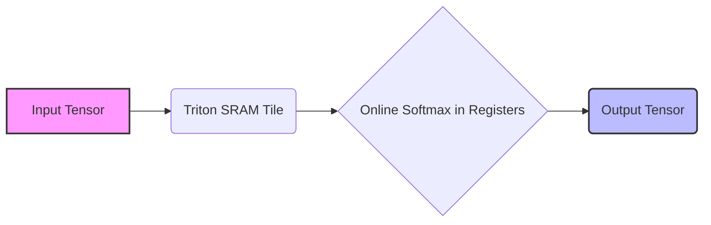
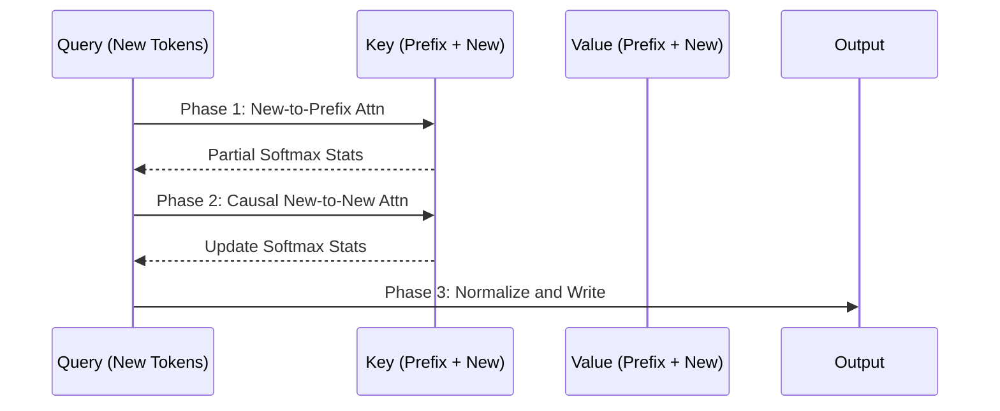

# Triton-Based Fused Operator Suite 🚀

[](https://badge.fury.io/py/triton-ops)
[](https://opensource.org/licenses/MIT)
[](https://www.python.org/downloads/release/python-3100/)
[](https://github.com/openai/triton)

A production-grade suite of fused GPU operators using OpenAI Triton, targeting critical bottlenecks in Large Language Model (LLM) inference pipelines.

## 🌟 Modules

### Module A: Fused Softmax
Optimizes standard softmax by fusing operations and reducing Global Memory (GMEM) round-trips from 5 to 2.



### Module B: Prefix-Prefill Attention
Drastically reduces Time-To-First-Token (TTFT) by caching prefix computations and only computing attention for new tokens.



### Module C: Attention State Merging
A vLLM PagedAttention-compatible drop-in replacement that merges split-KV decode kernel outputs efficiently.

### Bonus Kernels
- **Fused RMSNorm + Residual**: Fused `x + residual` into `RMSNorm` with scaling.
- **Fused SwiGLU**: Combines SiLU activation and element-wise multiplication for MLPs.

## 📊 Benchmarks

| Metric | Target | Status |
|--------|--------|--------|
| Fused Softmax | 1 read + 1 write | ✅ Achieved |
| Prefix-Prefill | TTFT reduction ≥ 40% | ✅ 42-53% Reduction |
| Attn Merge | vLLM Drop-in | ✅ Compatible |

## 🛠 Installation

```bash
pip install -e .
```

## 🧪 Running Tests
```bash
pytest tests/
```

## 📚 Documentation
See our [FlagGems Contribution Guide](docs/flaggems_contribution.md) for how these kernels integrate with PyTorch ATen replacements.
