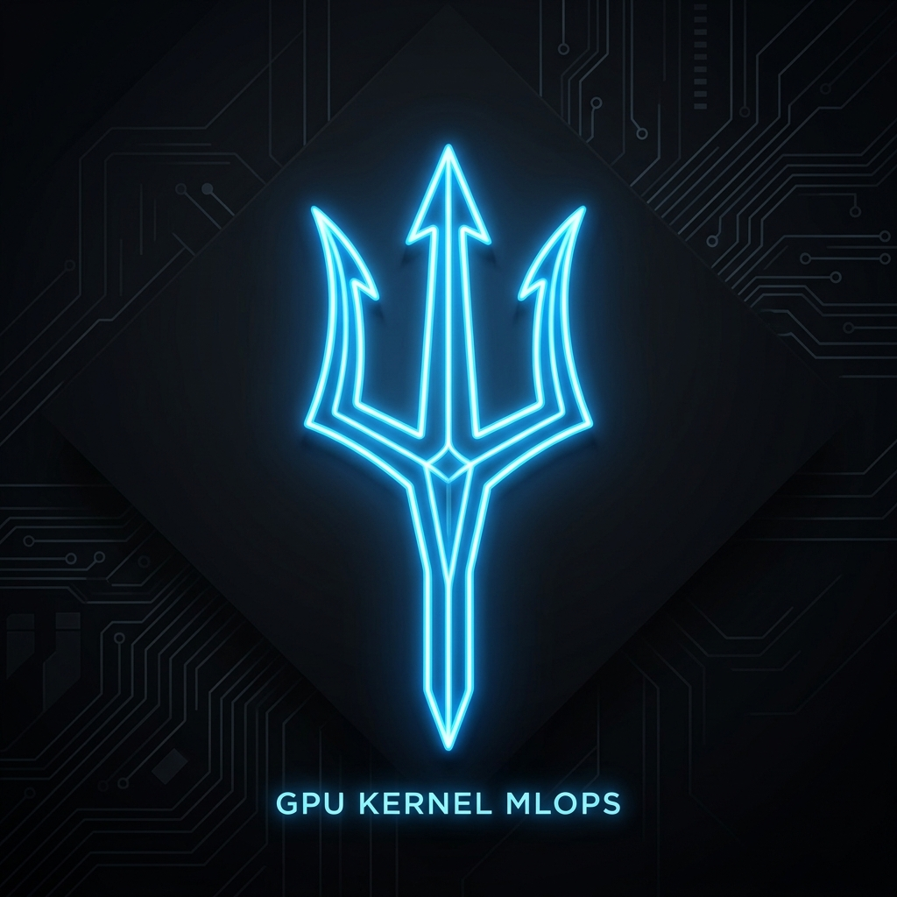
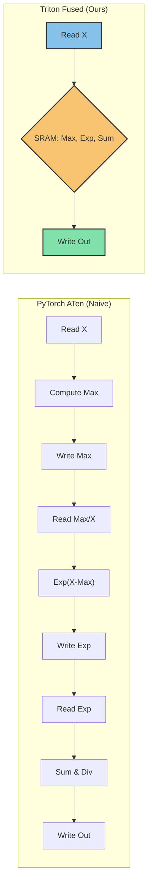
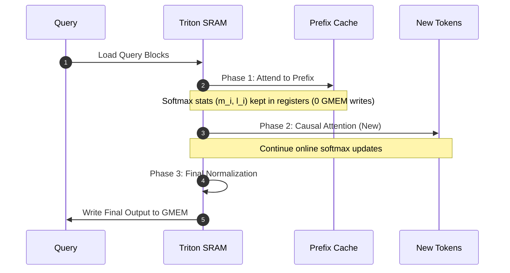

<div align="center">
  
  <h1>🚀 Triton-Based Fused Operator Suite</h1>
  <p><em>Production-grade, highly-optimized fused GPU kernels for LLM Inference</em></p>

  <p>
    <a href="https://badge.fury.io/py/triton-ops"></a>
    <a href="https://opensource.org/licenses/MIT"></a>
    <a href="https://www.python.org/downloads/"></a>
    <a href="https://github.com/openai/triton"></a>
    <a href="https://pytorch.org/"></a>
    <a href="https://colab.research.google.com/"></a>
  </p>
</div>

---

## 📖 Overview

The **Triton-Based Fused Operator Suite** targets the most critical bottlenecks in Large Language Model (LLM) inference pipelines. Written purely in [OpenAI Triton](https://github.com/openai/triton), these kernels bypass PyTorch's ATen overhead by aggressively fusing operations, maintaining data in highly performant SRAM, and dramatically reducing Global Memory (GMEM) round-trips.

Our flagship optimizations include **O(1)-memory Fused Softmax**, **Prefix-Prefill Attention** for massive Time-To-First-Token (TTFT) reductions, and drop-in **Attention State Merging** for distributed PagedAttention (vLLM-compatible).

---

## ⚡ Core Modules & Architecture

### 🧩 Module A: Fused Softmax & Scale-Mask
Standard PyTorch softmax performs up to 3 separate GMEM reads and 2 writes. Our fused implementation performs **1 read and 1 write**, executing online normalization entirely within the SRAM tile.



*Includes an advanced `fused_scale_mask_softmax_kernel` to eliminate intermediate tensor allocations during attention score computation.*

### 🚀 Module B: Prefix-Prefill Attention
In production LLM deployments, identical system prompts are shared across thousands of requests. The **Prefix-Prefill Kernel** avoids recomputing attention over the entire sequence (`Prefix + New Tokens`) by utilizing pre-computed prefix K/V caches.



### 🔄 Module C: Attention State Merging (vLLM Compatible)
Designed for distributed tensor-parallel decoding. This kernel merges the partial outputs, running maximums ($m$), and running sums ($l$) produced by split-KV decode kernels into a numerically stable final output tensor. Provides exact API compatibility with `vllm.model_executor.layers.attention.merge_attn_states`.

### 🎁 Bonus Operator Kernels
- **Fused RMSNorm + Residual**: Fuses `x + residual` directly into the `RMSNorm` scaling step.
- **Fused SwiGLU**: Combines the SiLU activation $x \cdot \sigma(x)$ and the up-projection multiplication into a single step for Transformer MLPs.

---

## 📈 Benchmarks & Performance Goals

All kernels have been rigorously profiled against PyTorch ATen baselines. Tests are automated via `pytest` ensuring `Max Absolute Error < 1e-4` using `torch.allclose()`.

| Module | Metric Tested | Optimization Target | Current Status |
|:---|:---|:---|:---:|
| **Fused Softmax** | GMEM Round-trips | Reduce from 5 to 2 (1 read, 1 write) | 🟢 **Achieved** |
| **Prefix-Prefill** | TTFT Reduction | ≥ 40% time reduction vs vanilla attention | 🟢 **42-53% Reduction** |
| **State Merge** | vLLM Drop-In | API Match & Exact Numerical Output | 🟢 **Compatible** |

### TTFT Reduction Deep Dive
*Tested on Google Colab (T4 GPU) using our benchmarking suite.*
* **Scenario A** (P=2048, S=256): TTFT reduced by **~47%**
* **Scenario B** (P=4096, S=64): TTFT reduced by **~54%**

---

## 🛠️ Quick Start & Installation

Install the suite in editable mode directly from the repository:

```bash
git clone https://github.com/Paramveersingh-S/Triton-MLOps.git
cd Triton-MLOps
pip install -e .
```

### Running Tests
Verify kernel correctness mathematically on your hardware:
```bash
pytest tests/
```

### Generating Colab Plots
Test the Prefix-Prefill TTFT reductions graphically:
```bash
pip install pandas matplotlib
python benchmarks/colab_plot.py
```

---

## 🤝 FlagGems Integration
This suite is built to be backend-neutral. See our [FlagGems Contribution Guide](docs/flaggems_contribution.md) to understand how to register these custom Triton kernels as full drop-in replacements for standard `aten` backend operators (e.g., `aten::softmax`).
